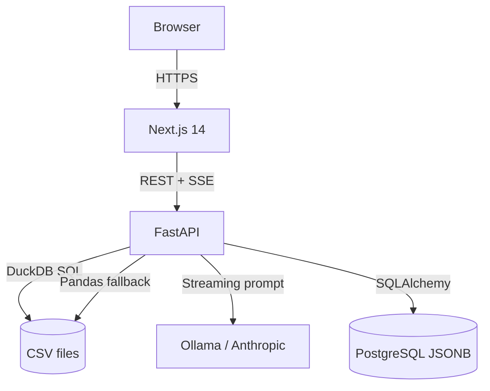

# AskMyData

[](https://github.com/jutamagno/askmydata/actions/workflows/ci.yml)

Talk to your CSV files using natural language. Upload a spreadsheet, ask questions in plain English (or Portuguese), and get streaming answers with charts — no SQL knowledge required.

## Quick start

```bash
# 1. Clone and configure
git clone https://github.com/jutamagno/askmydata
cp .env.example .env   # edit secrets

# 2. Start everything (pulls Ollama model automatically)
docker compose up --build

# 3. Open http://localhost:3000
```

The first startup pulls the `codellama` model (~4 GB). Subsequent starts are instant.

## Architecture



| Layer | Tech | Why |
|-------|------|-----|
| Frontend | Next.js 14 + TypeScript + Tailwind | App Router, SSE streaming, dark mode |
| Backend | FastAPI + SQLAlchemy + Alembic | Async, typed, zero-config migrations |
| Query engine | DuckDB → Pandas fallback | DuckDB handles 99% of analytical SQL; Pandas covers edge cases |
| LLM | Ollama (local) or Anthropic | Strategy pattern — swap with one env var |
| Database | PostgreSQL with JSONB | Native JSON columns for schema/profile/chart data |

## Tech decisions

**Why DuckDB?** Executes analytical SQL directly on CSV files without an import step. Handles JOINs across multiple files, window functions, and most OLAP patterns in milliseconds.

**Why Ollama as default?** Zero API cost, works offline, and `codellama` handles SQL generation well. Switch to Anthropic by setting `ANTHROPIC_API_KEY` — no code change needed (Strategy Pattern in `backend/modules/llm/`).

**Why SSE instead of WebSocket?** Streaming LLM responses need server→client push only. SSE is simpler (plain HTTP), works through any proxy, and doesn't need connection state management.

**Why JSONB over TEXT for schema/profile/chart_data?** Native indexing, querying operators, and no double-serialization bugs — store and retrieve Python dicts directly.

## Project structure

```
askmydata/
├── backend/
│   ├── modules/
│   │   ├── auth/          # JWT, Google OAuth, bcrypt
│   │   ├── projects/      # CRUD, CSV upload, schema + profile inference
│   │   ├── messages/      # conversation history per project
│   │   ├── query/         # DuckDB → Pandas → LLM pipeline, SSE streaming
│   │   └── llm/           # Strategy pattern: OllamaProvider, AnthropicProvider
│   ├── main.py            # app factory, rate limiting, request_id middleware
│   ├── config.py          # pydantic-settings
│   ├── exceptions.py      # AppError hierarchy
│   └── logger.py          # structlog JSON logging
└── frontend/
    ├── app/               # Next.js App Router pages
    ├── components/        # ChatBox, MessageBubble, DataProfilePanel, CsvSelector
    ├── hooks/             # useChat (streaming), useProjects
    └── lib/               # streamAsk, axios with JWT interceptor
```

## Configuration

| Variable | Default | Description |
|----------|---------|-------------|
| `DATABASE_URL` | — | PostgreSQL connection string |
| `SECRET_KEY` | — | JWT signing key (min 32 chars) |
| `ANTHROPIC_API_KEY` | `""` | Set to use Claude instead of Ollama |
| `OLLAMA_MODEL` | `codellama` | Any model available in your Ollama instance |
| `OLLAMA_BASE_URL` | `http://ollama:11434/v1` | Ollama OpenAI-compatible endpoint |
| `MAX_UPLOAD_SIZE_MB` | `10` | Max CSV upload size |
| `ACCESS_TOKEN_EXPIRE_MINUTES` | `480` | JWT TTL (8 hours) |

## Development

```bash
# Backend
cd backend && pip install -r requirements.txt
PYTHONPATH=.. alembic upgrade head   # runs 4 migrations (schema, chart_data, jsonb, csv_profile)
uvicorn backend.main:app --reload

# Frontend
cd frontend && npm install && npm run dev

# Tests
pytest --cov=backend --cov-report=term-missing   # SQLite in-memory, no Docker needed
cd frontend && npm test
```

### Migrations

| Version | Change |
|---|---|
| `0001_initial` | Users, projects, messages tables |
| `0002_add_chart_data` | Adds `chart_data` column to messages |
| `0003_jsonb_columns` | Converts schema/profile/chart_data to JSONB |
| `0004_csv_profile` | Adds `csv_profile` JSONB column to projects |

### Environment variables (full reference)

| Variable | Default | Required | Description |
|---|---|---|---|
| `DATABASE_URL` | — | Yes | PostgreSQL connection string |
| `SECRET_KEY` | — | Yes | JWT signing key (min 32 chars) |
| `ANTHROPIC_API_KEY` | `""` | No | Set to use Claude instead of Ollama |
| `OLLAMA_MODEL` | `codellama` | No | Any model in your Ollama instance (also: `qwen2.5-coder`, `sqlcoder`) |
| `OLLAMA_BASE_URL` | `http://ollama:11434/v1` | No | Ollama OpenAI-compatible endpoint |
| `GOOGLE_CLIENT_ID` | — | No | Google OAuth (optional) |
| `GOOGLE_CLIENT_SECRET` | — | No | Google OAuth (optional) |
| `MAX_UPLOAD_SIZE_MB` | `10` | No | Max CSV upload size |
| `ACCESS_TOKEN_EXPIRE_MINUTES` | `480` | No | JWT TTL (8 hours) |

## Security

- Rate limiting: 5 req/min on auth endpoints, 30 req/min on query (via slowapi)
- Password policy: min 8 chars, 1 uppercase, 1 digit
- JWT: 8h TTL with `jti` claim for future revocation
- SQL sanitization: comments stripped, only `SELECT`/`WITH` allowed (no DDL/DML)
- Upload limits: 10 MB max, `.csv` extension enforced

## API

| Method | Path | Description |
|--------|------|-------------|
| `POST` | `/auth/register` | Create account |
| `POST` | `/auth/login` | Get JWT token |
| `POST` | `/projects/` | Create project |
| `POST` | `/projects/{id}/upload` | Upload CSV (≤10 MB) |
| `POST` | `/query/` | Ask a question (synchronous) |
| `POST` | `/query/stream` | Ask a question (SSE token-by-token) |
| `GET` | `/messages/{project_id}` | Chat history |

## Roadmap

- [ ] **Excel export** — `GET /reports/{project_id}/export` returning `.xlsx` with all query results and charts in a single workbook
- [ ] **Scheduled reports** — cron-based email digest using APScheduler; send weekly summaries of the most-queried insights per project
- [ ] **Team workspaces** — multi-user projects with role-based access (owner / editor / viewer); currently all projects are private to the creating user
- [ ] **Vector search over column values** — embed column values at upload time (ChromaDB) for fuzzy matching ("similar to Paris" → finds "Paris, France" and "Paris, TX")
- [ ] **Excel (.xlsx) support** — convert via openpyxl before passing to DuckDB; multi-sheet files should create one project per sheet
- [ ] **Google OAuth** — the `.env.example` already has `GOOGLE_CLIENT_ID` / `GOOGLE_CLIENT_SECRET` placeholders; the `authlib` dependency is installed; wire up the OAuth flow in `backend/modules/auth/`
- [ ] **GPU support for Ollama** — the `docker-compose.yml` has the NVIDIA device reservation commented out; uncomment to enable GPU-accelerated inference
- [ ] **Streaming chart updates** — charts are currently rendered after the full response arrives; stream partial results so the chart updates as tokens come in
- [ ] **Query history search** — full-text search over past questions across all projects; useful when returning to a dataset after weeks

## License

MIT
